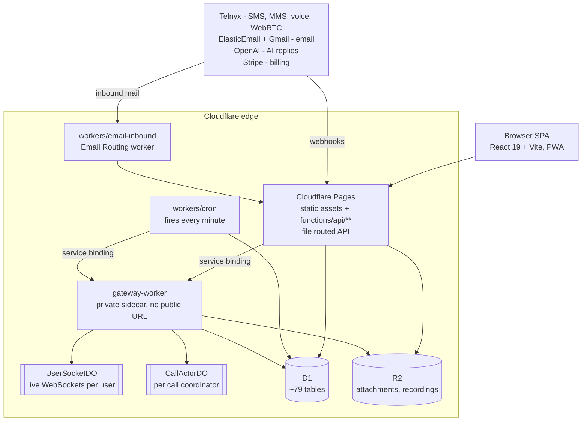

# WarmChats - AI Lead Engagement CRM for Real Estate, Built Entirely on Cloudflare

WarmChats is a serverless AI CRM that answers new real estate leads within seconds over SMS, email and voice,
qualifies them in a real conversation, and books appointments on the agent's calendar. The whole platform runs on
Cloudflare's edge: a React single page app on Pages, a file routed API of Pages Functions, and three purpose built
Workers backed by one D1 database and one R2 bucket. There is no origin server and no container anywhere in the stack.

Built by [Sarwar Alam](https://thesarwar.site), Lead Software Engineer and AI Architect.

**Stack:** TypeScript, React 19, Vite 8, Tailwind CSS 4, Cloudflare Pages Functions, Cloudflare Workers,
Durable Objects, D1 (SQLite), R2, OpenAI, Telnyx, ElasticEmail, Stripe.

---

## Table of contents

- [What it does](#what-it-does)
- [Architecture](#architecture)
- [The AI layer](#the-ai-layer)
- [Messaging, voice and compliance](#messaging-voice-and-compliance)
- [Tech stack](#tech-stack)
- [Repository layout](#repository-layout)
- [Getting started](#getting-started)
- [Deployment](#deployment)
- [Project status](#project-status)
- [Author](#author)
- [License](#license)

---

## What it does

A real estate agent's problem is speed to lead: the first person to reply usually wins the listing. WarmChats sits on
the inbound channels, replies instantly in the agent's own voice, and keeps following up until the lead books or opts out.

**Conversations**

- Unified inbox with per lead SMS and email threads, attachments, delivery status, inline appointment cards,
  send later scheduling, and a summary strip of the pending outbound queue.
- An AI Assist menu in the composer that drafts or rewrites the message you are typing (make professional,
  make shorter, make friendlier, appointment push, follow up suggestion), metered against a monthly AI credit balance.
- Browser calling over Telnyx WebRTC with an incoming call modal, call history filtered by missed or voicemail,
  and per call notes. Calls live inside the Inbox behind a Messages / Calls switcher.
- Recorded calls produce a transcript, summary, sentiment, intent and suggested follow up tasks, generated
  asynchronously so the call path stays fast.

**Pipeline**

- Leads with switchable board and table views, search and filters, a CSV import wizard, CSV export of the filtered
  list, and a detail panel with inline editing.
- Deals as kanban pipelines for Buyer, Seller and Renter with drag to move stages, a KPI strip and estimated commission.
- Listings, a property inventory with photos, that the inbound AI can search to match a buyer's stated criteria.
- Tasks combining AI generated priorities with a personal list of calls, texts, emails, showings and contracts.
- A week and month calendar for booking against a lead or as a standalone meeting.
- A dashboard with monthly KPI goals, a Needs Reply queue, hot leads, a 30/60/90 day conversion funnel and AI wins.

**Accounts and administration**

- Four roles: Owner, Manager, Representative and Guest. Routes are role guarded, Guests are kept out of Leads, Inbox
  and phone setup, and the Team pages and Admin control center are Owner and Manager only. Every admin endpoint
  re-enforces role and organization scope server side, so the UI gates are convenience rather than the security boundary.
- Brokerage tools for Users, Teams, Offices and Lead Routing, gated to the Growth plan.
- An organization scoped admin control center covering Overview, Users, Messaging, Goals, Integrations and Billing.
- Connected accounts: send email through Gmail OAuth or a verified business domain, and text from a Telnyx 10DLC number.
- Three self serve plans, Free, Starter at 89 USD per month and Growth at 149 USD per month, plus a demo only Custom
  Brokerage tier. Paid plans publish monthly SMS, email, AI message and calling minute allowances with per unit
  overages. Free is email only.
- Installable PWA with web push and native notification actions (Reply, Answer, Decline) wired back into the app.

---

## Architecture



**Cloudflare Pages** serves the SPA and the API from one origin. The API is file routed under `functions/api`,
spanning auth, leads, inbox, calling, automations, sequences, billing, notifications, listings and a public
`integrations/v1` API for third parties. Provider webhooks get their own functions. A Pages middleware redirects apex
traffic to the canonical `www` host for browser navigations but deliberately leaves `/api/*` alone, so server to server
webhooks and Authorization bearing requests are never redirected across origins.

**gateway-worker** is a private sidecar with `workers_dev` and preview URLs disabled. It is reachable only through the
Pages service binding `GATEWAY` and its own cron triggers. Every Durable Object concern lives here behind one router,
`/do/<class>/<name>/<method>`, instead of being scattered across Pages Functions:

- `UserSocketDO`, one per user, holds that user's live WebSocket connections using the hibernation API so multiple
  tabs work, and broadcasts server side events such as incoming calls and new message toasts.
- `CallActorDO`, one per live call, is the single writer that atomically decides which ring leg answered first.
  `/claim-winner` sets the winner exactly once and returns the loser to hang up; `/leg-down` reports exactly once when
  every dialed leg is down with no winner, so the caller can divert to voicemail. D1 has no row locks, so this
  coordination cannot be done in SQL.

WebSocket setup goes `/api/calling/ws42` to a Pages Function that authenticates the session cookie first, then proxies
the upgrade through the private binding to that user's `UserSocketDO`. The former `/api/calling/ws` path is now a
honeypot that logs probes and forwards nothing.

**workers/cron** exists because Pages cannot register cron triggers. It fires every minute and fans out eight isolated
jobs: sequence dispatch, scheduled messages, Gmail token refresh, appointment reminders, escalation advance, cleanup,
comp plan expiry and stale call recovery. Each job has its own timeout and error isolation so one hung provider call
cannot stall the tick, with a longer budget for the two queue draining senders.

**workers/email-inbound** is an Email Routing Worker: it receives mail to the reply domain, parses the MIME with
`postal-mime`, and POSTs a normalized payload to the app, throwing on failure so the sending server retries rather
than dropping the reply.

All three deployables bind the same D1 database as `D1DB`, so background jobs read and write the rows the API serves
with no cross service round trip. Post call AI runs off the hot path in a gateway cron job that pulls recordings from
Telnyx, stores them in R2, transcribes them and writes back insights with capped retries.

---

## The AI layer

Three agent identities exist, but only one is a full autonomous agent.

**Inbound** is a multi step OpenAI tool calling loop (gpt-4o-mini, maximum 6 steps) that runs on each inbound SMS or
email reply. It has 9 base tools: `send_message`, `update_lead`, `find_appointment_slots`, `book_appointment`,
`escalate_to_agent`, `create_task`, `upsert_deal`, `get_agent_knowledge` and `finish`. `escalate_to_agent` is removed
from the toolset when Human Takeover Detection is off, rather than merely hidden in the UI. Listing search and MMS are
earned tools, exposed only when listing search is enabled and the workspace has offerable inventory, with MMS further
limited to SMS threads.

**Assistant** is inbox side help: draft a reply, rewrite or improve a draft with thread context and tone, and a
natural language question endpoint over your leads. It is the one agent that defaults to off.

**Outbound** is not a conversation loop. One bounded call rewrites a campaign's opening message in the agent's voice at
enrollment, keeps merge tokens intact, and silently falls back to the original template if AI is off or the call fails.

What keeps it safe:

- **Three level kill switch.** A workspace master switch that is off by default and fails closed on a missing row, a
  per agent toggle, and a per lead AI status of paused, off or outbound only. Mandatory STOP and HELP compliance
  replies are never gated by it.
- **Booking is proposal only.** The agent must pull real open slots, the time is re-validated server side, and the
  appointment is created pending the agent's confirmation with a confirm task and a notification. A lead with an
  upcoming appointment cannot be double booked.
- **Major deal milestones are never applied by the AI.** Listing signed, under contract, escrow, closed, lease and won
  are recorded as a suggestion plus a confirm task, and stage moves must quote the lead's own words.
- **Field edits carry provenance.** A hand set value is not overwritten unless there is high confidence evidence of
  changed intent, and every edit records old value, new value, confidence and the triggering message.
- **Deterministic takeover runs before the model.** An upset lead or a request for a real person returns early, so no
  AI reply is generated at all, after opening an escalation and an urgent task.
- **Bounded failure.** With no OpenAI key or on any loop error, SMS leads fall back to a deterministic template
  qualification flow. Replies are length capped at 1000 characters for SMS and 4000 for email, tool output is
  truncated, and thread history is capped at 50 messages.
- **Fair Housing compliance, an anti hallucination rule, a service area rule and an AI disclosure rule** are baked into
  the base prompt for every agent and cannot be toggled off.

The system prompt is assembled per agent from live account data: profile facts, tone and persona, knowledge base FAQs,
custom qualification questions scoped by lead type, custom auto responder rules, always say and never say rules,
booking timezone and the deal pipeline taxonomy. A Test AI sandbox role plays a reply using that same prompt and
returns a confidence score, intent tag and urgency, with no tools and nothing sent to any lead.

Every AI action is written to an activity log that powers the Logs and Activity views.

---

## Messaging, voice and compliance

Compliance is a first class constraint here, not an afterthought. US SMS is regulated by the TCPA and carrier 10DLC
rules, and email by CAN-SPAM, so the send path enforces them centrally rather than trusting each caller.

- **10DLC is built into onboarding.** Agents search and provision a US number and are registered under the platform's
  shared master brand and campaign instead of paying for their own. Texting stays blocked with a specific reason
  (free plan, registration pending, rejected, number not yet assigned) rather than failing silently.
- **One queue.** All delayed, queued and campaign traffic flows through a single `scheduled_message` table drained
  every minute. Rows are claimed atomically, rows stuck mid send are reclaimed after a grace period, and retryable
  provider errors (429, 5xx, network) are retried while 4xx are not.
- **Live replies beat bulk.** A waiting lead's AI reply is drained ahead of campaign drips, so a large queued campaign
  can never starve a real conversation.
- **Quiet hours** are enforced in the lead's own timezone, falling back to the workspace timezone, against a window
  defaulting to 8am to 9pm. Blocked messages are queued for the next local opening, never dropped. A manual send
  outside the window warns and asks for confirmation instead of hard blocking.
- **Per second rate limiting** backed by D1, keyed on the sending number for SMS and the sending domain for email:
  49 SMS/sec, 14 MMS/sec, 10 emails/sec by default.
- **AI pacing.** AI texts to one handset keep a 30 second minimum gap and a rolling cap of 10 per hour to stay under
  carrier spam heuristics. Over paced messages are delayed, not discarded.
- **Opt out is workspace wide** and matches on the last 10 digits, so reformatted or re-imported numbers still match.
  Opting out cancels every queued text to that number, and consent is tracked per phone number so duplicate lead
  records cannot reintroduce it.
- **Footers are added where required, not everywhere.** The STOP footer goes on a program's first message, a sequence
  opener or a marketing blast, and is skipped for contacts who already consented. Marketing email carries a CAN-SPAM
  footer with postal address and a signed per recipient unsubscribe link, plus RFC 8058 one click List-Unsubscribe
  headers so Gmail and Yahoo render a native unsubscribe button. A marketing send with no business address on file is
  refused.
- **The unsubscribe page is public and HMAC verified**, so nobody can bulk unsubscribe another workspace's leads.
- **Inbound Telnyx webhooks are Ed25519 signature verified** when `TELNYX_PUBLIC_KEY` is set.

Voice: the server mints a short lived Telnyx WebRTC token per agent so raw SIP credentials never reach the browser,
with an agent first PSTN option that dials the agent's cell instead. Inbound calls ring browser and phone at once and
the first leg to answer is bridged. Missed calls can divert to a text to speech voicemail greeting that records the
caller, opt in per workspace. A background sweep finalizes calls whose hangup webhook never arrived, unanswered rings
after 5 minutes and connected calls after 2 hours, so phantom active calls cannot block the agent's next call.

A per workspace mock mode routes outbound text and email into a log table instead of the real providers, so campaigns
and AI flows can be exercised end to end without contacting real people. Voice is not mocked.

---

## Tech stack

| Layer | Choice |
| --- | --- |
| Frontend | React 19.2, TypeScript 6.0, Vite 8, React Router 7, TanStack Query 5 |
| Styling | Tailwind CSS 4.3 via `@tailwindcss/vite`, CSS first setup with no `tailwind.config.js` |
| UI | Radix UI primitives (dropdown-menu, toast, tooltip), lucide-react, clsx + tailwind-merge, class-variance-authority |
| API | Cloudflare Pages Functions, file routed under `functions/api` |
| Realtime and voice | Cloudflare Worker + Durable Objects (`UserSocketDO`, `CallActorDO`), `@telnyx/webrtc` |
| Background jobs | Cloudflare Worker on a one minute cron trigger |
| Inbound email | Cloudflare Email Routing Worker, `postal-mime` |
| Data | D1 (SQLite) for everything, R2 for attachments and recordings |
| Auth | `jose` JWT plus session cookies, Google OAuth, Cloudflare Turnstile on public forms |
| Integrations | Telnyx, ElasticEmail, Gmail API, OpenAI, Stripe, Mixpanel |
| Tooling | pnpm 11.5, Wrangler 4, ESLint 10 flat config, knip, depcheck |

TypeScript uses a solution style project reference layout. The root `tsconfig.json` holds no files and references three
projects, so each area is checked under its own rules: `tsconfig.app.json` for `src/**` with DOM libraries,
`tsconfig.functions.json` for `functions/**` with `@cloudflare/workers-types` and the strictest settings including
`exactOptionalPropertyTypes` and `noUncheckedIndexedAccess`, and `tsconfig.node.json` for build tooling.
`gateway-worker` keeps its own standalone config.

The Vite build splits each `node_modules` package into its own vendor chunk, pins React to a dedicated chunk, and
stamps `dist/sw.js` with a per build version so installed PWAs reliably notice a new deploy. Local development runs the
real backend: a custom Vite plugin forks `wrangler pages dev` and proxies `/api` to it, so Pages Functions execute
against local D1 rather than mocks.

---

## Repository layout

```
src/                    React SPA (pages, components, contexts, hooks)
functions/
  api/                  Pages Functions, one file per route (~40 route groups)
  _shared/              auth, D1 helpers, send engine, compliance guards, AI orchestrator
gateway-worker/         Durable Objects, WebSockets, WebRTC calling, post call AI cron
workers/
  cron/                 one minute dispatcher: sends, sequences, reminders, cleanup
  email-inbound/        Email Routing worker, MIME parsing
sql/                    numbered schema files, applied in order, plus seed and verify
sql/patches/            incremental patches, applied by hand
scripts/                lint runner, wrangler dev bootstrap, key generators
zapier-app/             Zapier integration definition
```

---

## Getting started

### Prerequisites

- Node.js and pnpm 11.5, pinned via `packageManager`. There is no Node version pin in the repo.
- A Cloudflare account. Wrangler ships as a dev dependency, so `pnpm install` is enough.

### Install and configure

```bash
pnpm install
```

Create `.dev.vars` for the Workers runtime and `.env` for Vite build time variables. Nothing secret is committed;
see [Environment variables](#environment-variables) below for the names.

### Database

The schema is plain SQL in `sql/`, applied in numeric prefix order: `0.drop-tables.sql`, then the `1.` through `27.`
create scripts, then `100.seed.sql` and `200.verify.sql`. `200.verify.sql` counts roles, users, orgs, memberships and
leads so you can confirm the seed applied.

```bash
pnpm db-fast          # reset and reseed the local D1
pnpm db-fast-remote   # same against remote, with a y/n prompt
```

Two caveats. The `db-*` scripts are PowerShell one liners, so on macOS and Linux run the equivalent
`wrangler d1 execute <db> --file=sql/<n>.sql` per file in numeric order. They also hardcode the database name
`warmchats-db`, so pass your own D1 name. Files in `sql/patches/` are not picked up by any script and must be applied
by hand.

### Run it

Order matters, the gateway must be up first.

```bash
pnpm dev-ws     # 1. calling and WebSocket gateway on :8789
pnpm dev        # 2. Vite on :5173, forks `wrangler pages dev` on :3333 and proxies /api to it
pnpm dev-cron   # 3. cron worker on :8788 with --test-scheduled
```

```bash
pnpm cron:trigger   # fire one cron tick on demand
pnpm cron:check     # inspect the scheduled_message queue
pnpm cron:next      # back date the next queued message so the following tick picks it up
pnpm mock:logs      # tail mock_send_log when mock mode is on
```

Run every local process from the repository root. Wrangler persists local D1 state next to whichever config directory
you launch from, so `cd workers/cron && wrangler dev` silently creates a second empty database.

### Quality gates

```bash
pnpm lint            # ESLint (max-warnings 0), tsc -b, knip and depcheck, in parallel
pnpm lint-frontend   # tsc --noEmit for src/
pnpm lint-backend    # tsc --noEmit for functions/ and workers/
pnpm build           # vite build
```

Results are written to `errors-eslint.log`, `errors-ts.log`, `errors-unused.log` and `errors-depcheck.log`. Passing a
flag runs only that tool; with no flag `pnpm lint` runs all four. Do not substitute a bare `tsc --noEmit`: the root
config has no files and exits 0 even when a referenced project fails. There is no test runner, lint is the gate.

### Environment variables

Set locally in `.dev.vars` (Workers) and `.env` (Vite). In production use
`wrangler pages secret put NAME --project-name <project>` and `wrangler secret put NAME --name <worker>`.

<details>
<summary>Pages project</summary>

`ENV`, `MOCK_SEND_APIS`, `FRONTEND_URL`, `PUBLIC_SITE_URL`, `PUBLIC_BASE_URL`, `REPLY_DOMAIN`, `SUPPORT_EMAIL`,
`JWT_SECRET`, `EMAIL_UNSUB_SIGNING_KEY`, `FERNET_KEY`, `TURNSTILE_SECRET_KEY`, `SUPER_ADMIN_EMAILS`,
`GOOGLE_CLIENT_ID`, `GMAIL_OAUTH_CLIENT_ID`, `GMAIL_OAUTH_CLIENT_SECRET`, `GMAIL_OAUTH_REDIRECT_URI`,
`GMAIL_PUBSUB_TOPIC_FULL_NAME`, `OPENAI_API_KEY`, `STRIPE_SECRET_KEY`, `STRIPE_WEBHOOK_SECRET`, `STRIPE_PRICE_FREE`,
`STRIPE_PRICE_STARTER`, `STRIPE_PRICE_GROWTH`, `TELNYX_API_KEY`, `TELNYX_PUBLIC_KEY`, `TELNYX_CONNECTION_ID`,
`TELNYX_CREDENTIAL_CONNECTION_ID`, `TELNYX_SIP_DOMAIN`, `TELNYX_VOICE_PROFILE_ID`, `TELNYX_MESSAGING_PROFILE_ID`,
`TELNYX_MASTER_CAMPAIGN_ID`, `TELNYX_MASTER_BRAND_ID`, `ELASTIC_SENDER_NAME`, `ELASTIC_SENDER_EMAIL`,
`ELASTIC_EMAIL_API_KEY`, `ELASTIC_WEBHOOK_URL`, `VAPID_PUBLIC_KEY`, `VAPID_PRIVATE_KEY`, `VAPID_CONTACT_EMAIL`.

</details>

<details>
<summary>Cron worker, gateway worker, inbound email worker</summary>

Cron: `ENV`, `MOCK_SEND_APIS`, `TELNYX_API_KEY`, `ELASTIC_EMAIL_API_KEY`, `ELASTIC_SENDER_EMAIL`,
`ELASTIC_SENDER_NAME`, `REPLY_DOMAIN`, `EMAIL_UNSUB_SIGNING_KEY`, `FERNET_KEY`, `GMAIL_OAUTH_CLIENT_ID`,
`GMAIL_OAUTH_CLIENT_SECRET`, `FRONTEND_URL`, `PUBLIC_BASE_URL`, `VAPID_PUBLIC_KEY`, `VAPID_PRIVATE_KEY`,
`VAPID_CONTACT_EMAIL`.

Gateway: `ENV`, `MOCK_SEND_APIS`, `OPENAI_API_KEY`, `TELNYX_API_KEY`.

Inbound email: `INBOUND_ENDPOINT`.

</details>

<details>
<summary>Frontend build time (Vite)</summary>

`VITE_API_BASE`, `VITE_API_SCRIPT_URL`, `VITE_CALLING_WS_URL`, `VITE_GOOGLE_CLIENT_ID`, `VITE_MIXPANEL_TOKEN`,
`VITE_STRIPE_PUBLISHABLE_KEY`, `VITE_TURNSTILE_SITE_KEY`, `VITE_VAPID_PUBLIC_KEY`, and four more resolved at build time.

</details>

Helper generators: `pnpm gen:vapid` for a web push VAPID pair, `pnpm gen:unsub-secret` for the unsubscribe signing key.

### Cloudflare bindings

A D1 database bound as `D1DB`, an R2 bucket bound as `ATTACHMENTS`, a `GATEWAY` service binding from Pages to the
gateway worker, and the `USER_SOCKET` and `CALL_ACTOR` Durable Object classes. The cron worker triggers every minute;
the gateway worker triggers every minute plus daily at 00:00 UTC for billing cycle rollover.

---

## Deployment

```bash
pnpm upload        # lint, build, then wrangler pages deploy dist
pnpm upload-ws     # gateway worker
pnpm upload-cron   # cron worker
```

The inbound email worker has no root script; deploy it from its own directory with `npm install && npx wrangler deploy`.

```bash
pnpm realtime-logs        # tail Pages
pnpm realtime-logs-ws     # tail gateway
pnpm realtime-logs-cron   # tail cron
```

---

## Project status

This is a complete, deployed product that is no longer under active development. It is published as a reference
implementation of a non trivial application built entirely on Cloudflare's serverless primitives: Pages Functions,
Workers, Durable Objects, D1, R2 and Email Routing, with a real LLM tool calling agent wired into a regulated
messaging pipeline.

Every credential that ever appeared in this repository has been rotated and removed from the git history. Configuration
files ship with placeholders; supply your own values as described above.

---

## Author

**Sarwar Alam**, Lead Software Engineer and AI Architect.

Full stack developer bridging UX and complex algorithms, building web applications powered by machine learning while
keeping deployment and scalability in scope. Roughly 5 years with Python and Django, 3 years with React and Next.js,
and 2 years building machine learning, NLP and RAG chatbot systems, alongside cloud and DevOps work across
AWS, GCP, Azure and Cloudflare.

- Portfolio: [thesarwar.site](https://thesarwar.site)
- GitHub: [@thesarwars](https://github.com/thesarwars)
- LinkedIn: [monsieursarwar](https://www.linkedin.com/in/monsieursarwar)

Available for work on AI agents, LLM integrations, and serverless platform engineering.

---

## License

No license file is currently included, so default copyright applies and no rights to use, copy, modify or distribute
this code are granted. If you want this to be open source, add an explicit license file.
