# WarmChats — An AI Sales Employee for Real-Estate Teams

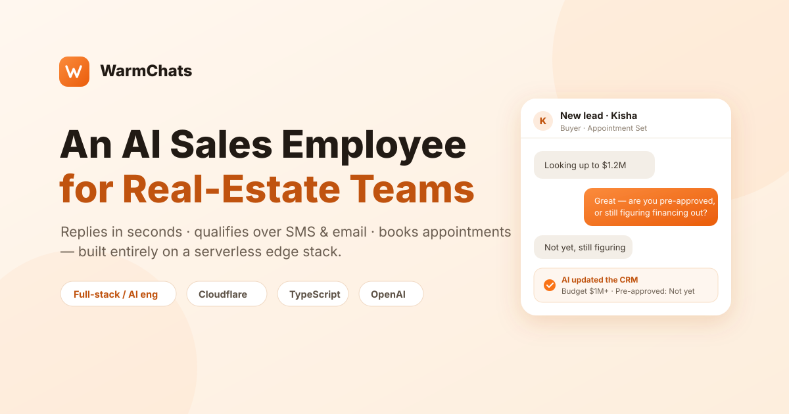

> A production, multi-tenant SaaS that acts as an always-on AI sales assistant for
> real-estate agents: it replies to new leads in seconds, qualifies them over SMS
> and email, books appointments, and keeps the CRM up to date — entirely on a
> serverless edge stack.

**Role:** Full-stack / AI engineer (build, harden, and launch)
**Domain:** Real-estate CRM + conversational AI + telephony/messaging
**Stack:** TypeScript · React · Cloudflare (Pages Functions, Workers, Durable Objects, D1) · OpenAI · Telnyx (SMS + voice) · ElasticEmail + Gmail · Stripe

---

## Overview

WarmChats is a CRM whose headline feature is an autonomous "AI sales employee."
When a lead comes in, the AI answers within ~30 seconds, figures out whether they
are a buyer or seller, asks the right qualification questions one at a time,
records what it learns on the lead profile, and pushes toward a booked
appointment — while staying compliant with SMS/telephony regulations and never
stepping on a human agent's manual edits.

I worked across the whole system: the AI orchestration layer, the messaging and
calling pipelines, the CRM data model, the analytics/KPI surfaces, and the
compliance and billing plumbing. Much of the highest-value work was taking an
~80%-complete product and making it **correct, consistent, and safe** under real
production data — the difference between a demo and something a business can run
its pipeline on.

---

## The Product

- **Speed-to-lead:** instant, on-brand first reply per lead type (buyer, seller,
  open-house, unknown), then a follow-up cadence.
- **Conversational qualification:** the AI detects intent, then walks the correct
  script (buyer: budget → timeline → financing; seller: property → occupancy →
  motivation), one question per message, and saves each answer to the lead.
- **Booking:** proposes real open slots from the agent's calendar and books
  appointments (pending human confirmation).
- **Unified inbox:** SMS, email, and calls for each lead in one conversation view,
  with an AI-drafted reply, message status, and a live lead-intelligence panel.
- **Campaigns / outbound sequences:** multi-step drips across SMS + email with
  per-step scheduling and audience enrollment.
- **Dashboards & pipeline:** live KPIs (pipeline value, hot leads, appointments,
  conversion funnel, messaging analytics) and a drag-and-drop deal pipeline.
- **Multi-tenant + billing:** organizations, roles, usage metering, and live
  Stripe subscriptions.

---

## Product tour

> Real screenshots from the app (contact details redacted for privacy).

**Dashboard** — the agent's home: monthly goals, a live "Needs Reply" queue,
"AI wins today," the pipeline-conversion funnel, and AI deal recommendations.

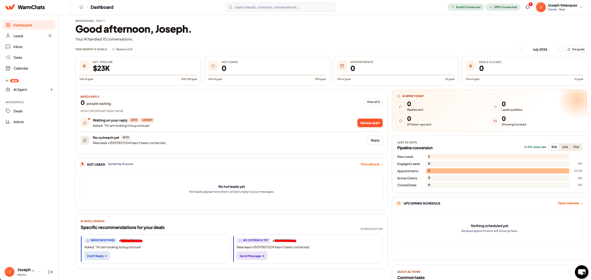

**AI Agent · Inbound** — inbound automations that route themselves. New-lead →
instant reply, lead replies → qualify, missed call → auto-text, booking intent →
appointment — each a live, toggleable flow with a *trigger → AI action → result*.

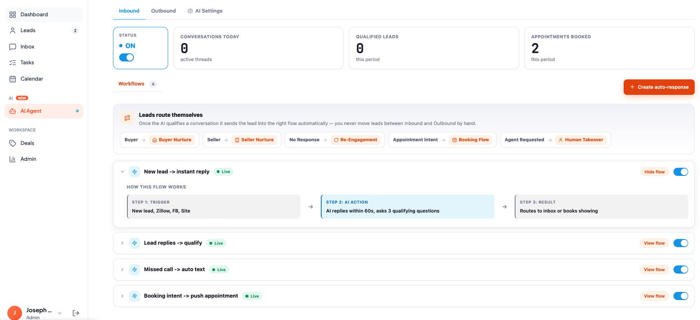

**AI Agent · Outbound** — outbound workflows: multi-step SMS/email sequences
(*trigger → AI follow-up → outcome*) with per-workflow enrollment counts, reply
rate, and appointment stats.

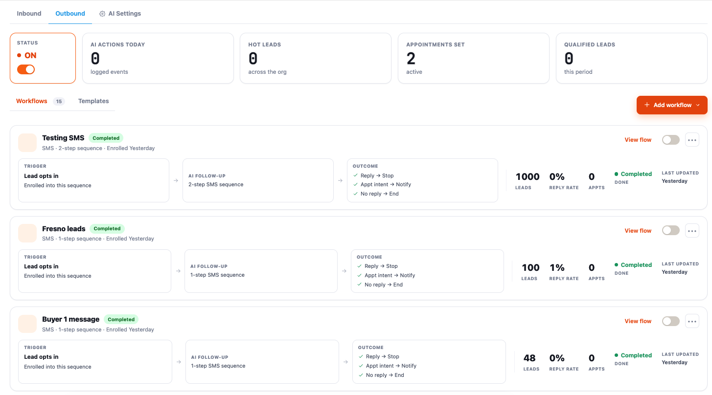

**Calls** — the AI-powered calling workspace: call log, missed-call recovery,
voicemails, live KPIs, and per-call actions (call back, text, schedule, note).

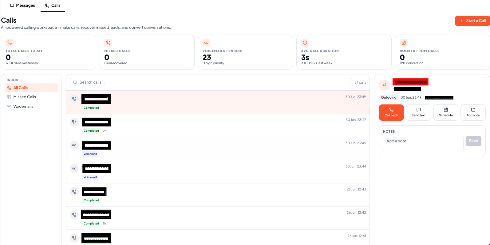

**Tasks** — the AI action center: prioritized "AI Priorities" cards (confirm
appointments, call back missed calls) over a full task table with list/board views.

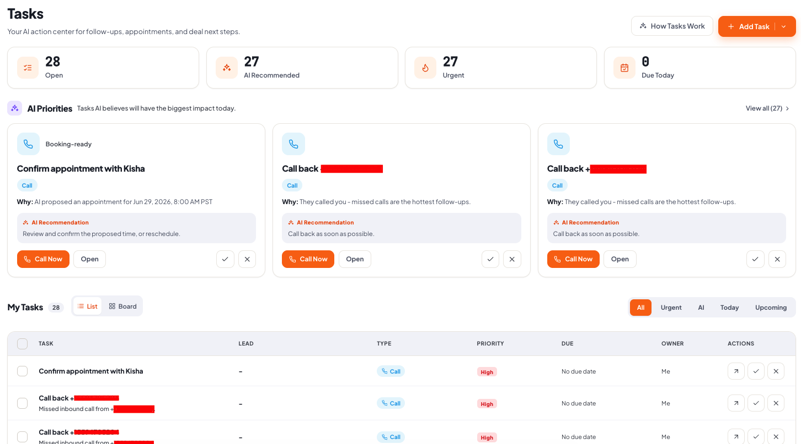

---

## Architecture

The entire product runs **serverless on Cloudflare** — no always-on servers — which
keeps it cheap to operate and globally low-latency, but forces a lot of interesting
design decisions around statelessness, scheduling, and eventual consistency.

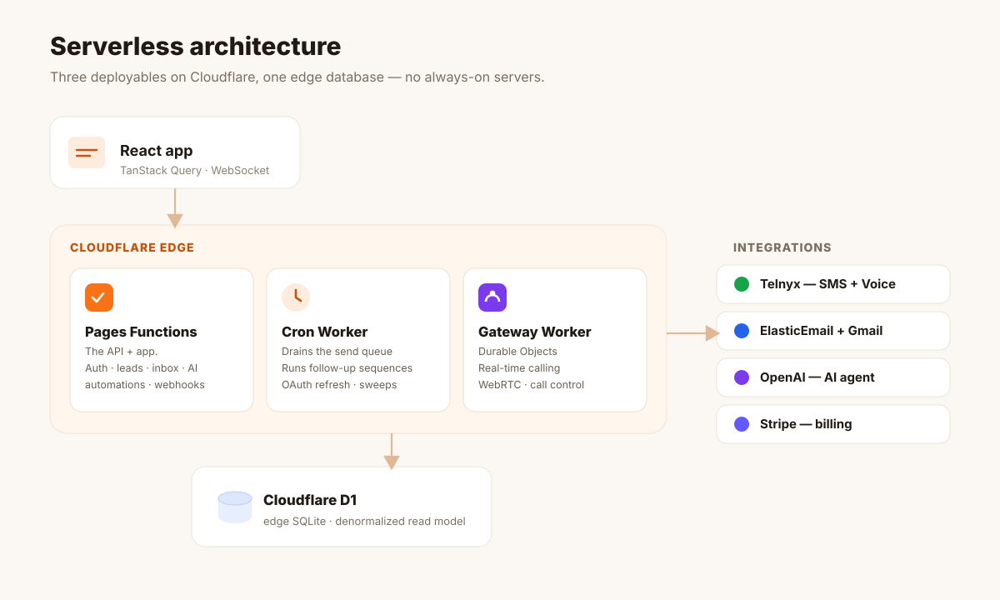

**Three deployables, one database:**

1. **Pages Functions** — the API and app. Every HTTP endpoint (auth, leads, inbox,
   AI, automations, webhooks) is an edge function.
2. **A dedicated Cron Worker** — because Pages Functions can't hold cron triggers.
   It drains the outbound send queue, runs follow-up sequences, refreshes OAuth
   tokens, sweeps stale state, and reverts lapsed billing — idempotently, on a
   per-job time budget so one slow job can't wedge the others.
3. **A Gateway Worker with Durable Objects** — for real-time calling (WebRTC in the
   browser, call-control fork legs, busy-on-busy handling). Durable Objects give
   the single-writer coordination a stateless function can't.

**Data:** Cloudflare **D1** (edge SQLite). Because the runtime is stateless and
queries must be cheap at the edge, the read model leans on **denormalized columns**
(e.g. a per-lead "last activity" timestamp/direction the inbox sorts by) that every
write path must keep in sync — a recurring theme below.

---

## Selected Engineering Challenges

The parts I'm proudest of are less about "adding a feature" and more about making a
complex, multi-channel, AI-driven system **behave correctly and predictably**.

### 1. An AI that qualifies leads *and* can be trusted with the database

The AI agent is a tool-calling loop: detect intent → ask the next missing qualifier
→ save what it learns → book when ready → escalate to a human when it should.

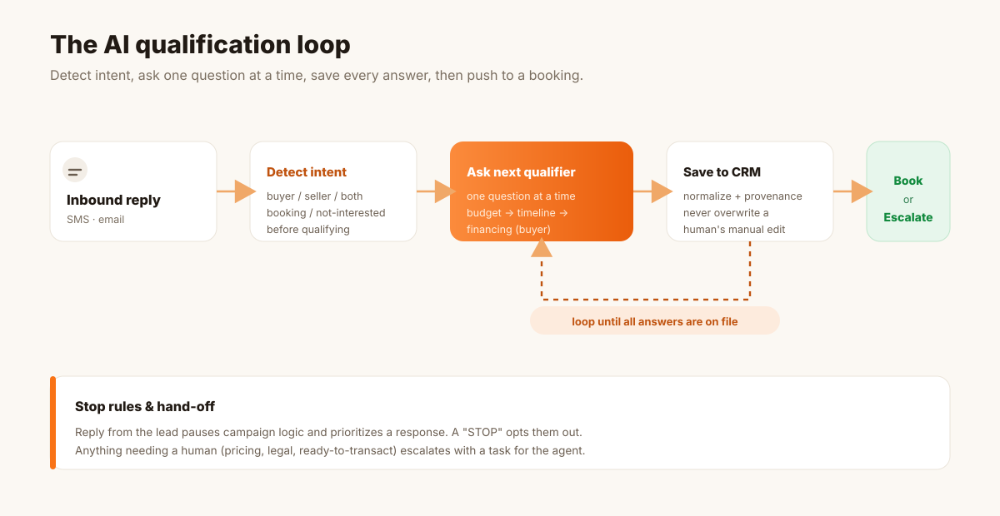

Two design choices made it dependable rather than flaky.

**A deterministic backstop.** LLMs don't reliably call their "save to CRM" tool on
the same turn they answer, so every inbound reply also runs a deterministic
classifier that extracts and persists structured fields *before* the model even
responds. The AI's tool calls become an enhancement, not a single point of failure.

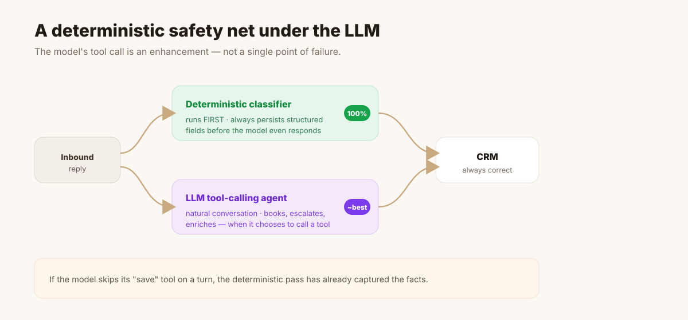

**A governed field-write engine.** Every AI-driven write to a "smart" lead field
(stage, type, budget, area, source) flows through one choke point that normalizes
free text to a canonical option set, enforces a manual-override guard so the AI
never clobbers a human's edit, stamps per-field provenance (`ai` vs `manual` +
confidence), and writes an auditable transition row.

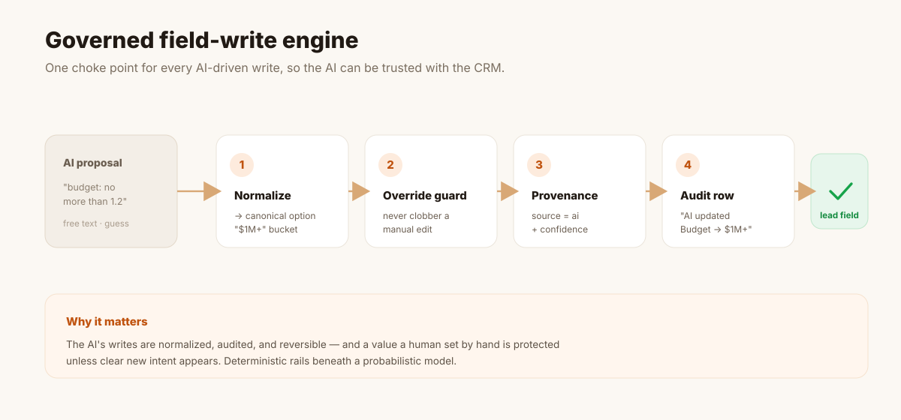

**A representative bug I fixed:** a lead who said *"no more than 1.2"* (i.e. $1.2M)
was being saved as **Budget: Under $300k** — the extractor treated a bare decimal as
*thousands* (`1.2 → $1,200`). In a home-price context a small decimal means
*millions*, so I rewrote the parser accordingly (and to ignore non-money numbers, so
"2.5 bath" in the same sentence isn't read as $2.5M). Small bug, but exactly the kind
that quietly erodes trust in an "AI that fills in your CRM."

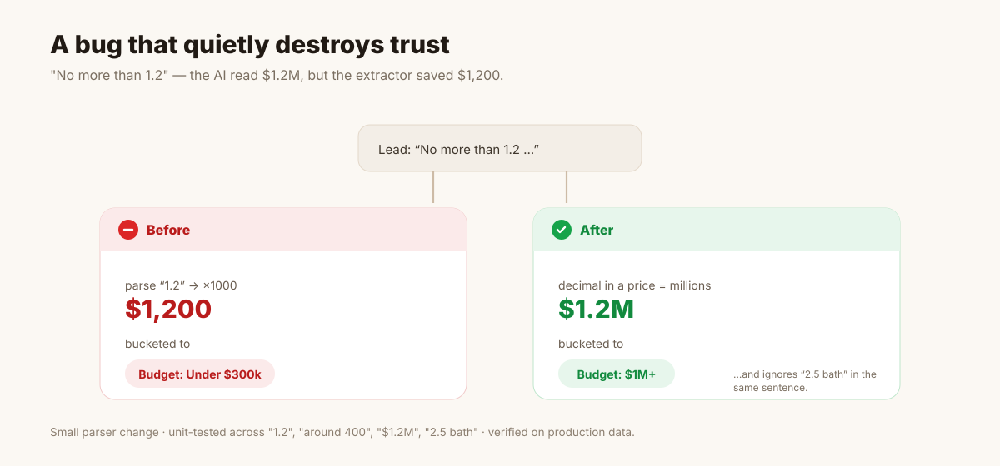

I also added a conservative, context-aware detector for answers like *"Not yet, still
figuring it out"* — which a single-message classifier can't interpret — by reading
the reply against the *prior* question, tight enough that it never invents data.

### 2. Messaging deliverability & compliance

Sending A2P SMS to real people means TCPA/CTIA/10DLC compliance is not optional. I
worked across quiet-hours, suppression, opt-in/opt-out state, and the
"Reply STOP to opt out" footer rules.

A subtle consent bug: the STOP footer should appear only for leads who haven't opted
in — but consent was read from a *single CRM row*, while the same phone number can
exist as several lead rows. So one campaign could send the *same person* two
identical texts, one with the footer and one without. I re-scoped the decision to the
**phone number** (matched on the last 10 digits to survive formatting differences)
and verified against production so a genuinely cold number still gets the footer.

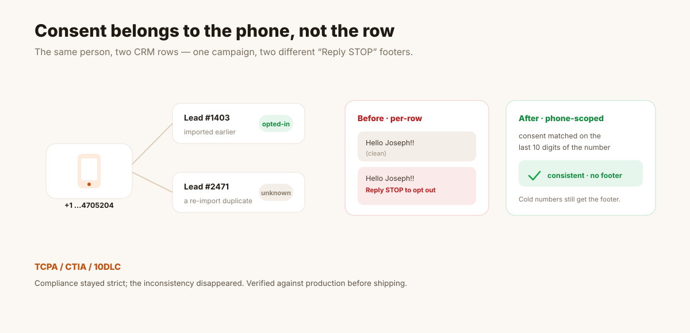

### 3. Data integrity across a denormalized read model

Because the inbox and dashboards read denormalized columns for speed, **every write
path has to maintain them** — and when one doesn't, numbers silently disagree.

The clearest example: the same "Needs Reply" metric read **0, 2, and 5** in three
places at once. The inbox fast path trusted a stale column, the filtered view
recomputed from messages, opted-out ("STOP") leads were being counted even though you
can't reply to them, and the dashboard card counted a broader feed than the queue it
linked to. I unified the definition — *last message inbound **and** the lead is still
reachable* — applied it identically everywhere, fixed the upstream opt-out
persistence, and backfilled the drift.

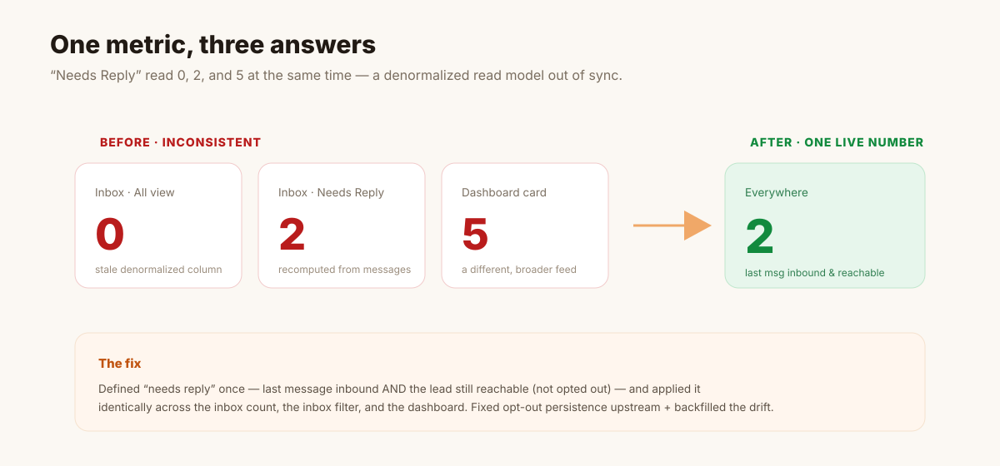

### 4. A real-time inbox on stateless infrastructure

The inbox behaves like a modern messaging app: newest conversation on top, live
previews, unread badges, no manual refresh. On stateless edge infra that meant
combining a **WebSocket push** (a new inbound message surfaces near-instantly) with a
**background poll** as the always-on fallback — plus making sure *every* send/receive
path (inbound, AI reply, and bulk campaign sends) reliably bumps the recency column.

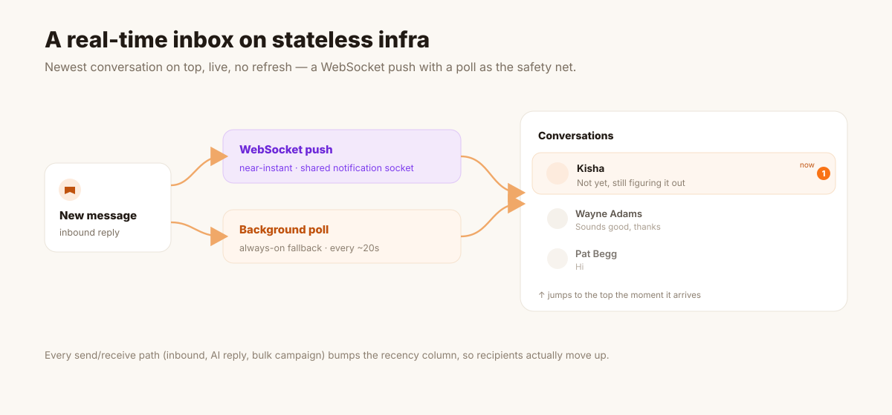

### 5. Making destructive operations safe (delete + in-flight workflows)

Deleting a lead should be safe and shouldn't leave ghosts. When a lead is deleted its
conversation history is purged so a re-import starts clean — but the *opt-out record
is kept*, because a "STOP" must never be forgotten. And I mapped exactly what happens
if you delete a lead mid-campaign: the send queue dispatches by a *frozen destination
address*, so a deleted lead would keep getting texted. The correct design cancels only
that lead's *pending* sends, leaving the campaign and every other enrolled lead
untouched. I scoped and documented this before writing it — "delete" touching
analytics, billing, and live campaigns is exactly where a careless change causes real
damage.

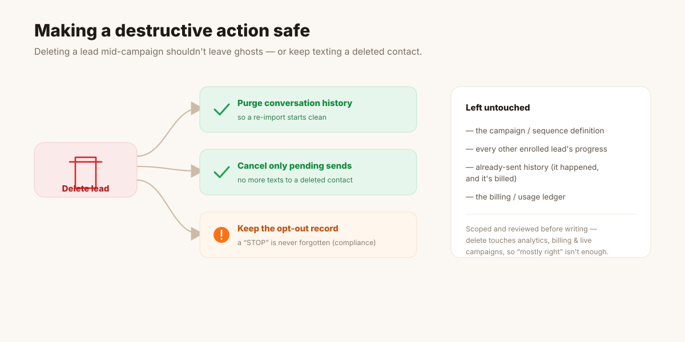

---

## How I Worked

- **Verification-driven fixes.** I reproduced and confirmed issues against real
  production data (careful, read-first queries), wrote small unit tests for the
  tricky parsing/regex logic (budget scaling, phone validation, consent detection),
  and validated the fix before shipping — rather than trusting that a change "looks
  right."
- **AI-assisted adversarial review.** For high-risk changes (anything touching
  compliance, money, or destructive deletes) I ran adversarial reviews that
  deliberately tried to *break* the fix — surfacing real edge cases (a 10-digit ID
  mistaken for a phone number; a lender *offer* mistaken for a pre-approval answer)
  that I closed before deploy.
- **Scope discipline.** The product had explicit build phases. When a request
  actually belonged to a later phase, I said so and documented the plan instead of
  quietly expanding scope.

A big enabler was the app's built-in **QA harness**: a mock-send mode that intercepts
every Telnyx / ElasticEmail / Gmail send into a log instead of charging or texting
anyone, plus a "simulate inbound reply" tool that writes an inbound message exactly as
a provider webhook would. That let me drive the entire pipeline — notifications,
opt-out handling, AI follow-up — end to end, at volume, without a real phone or mailbox.

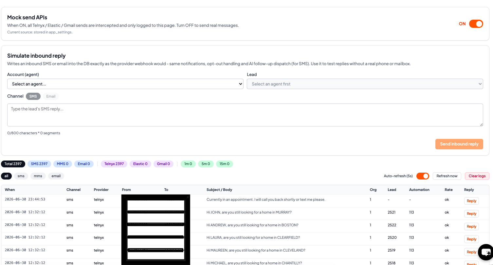

---

## Outcomes

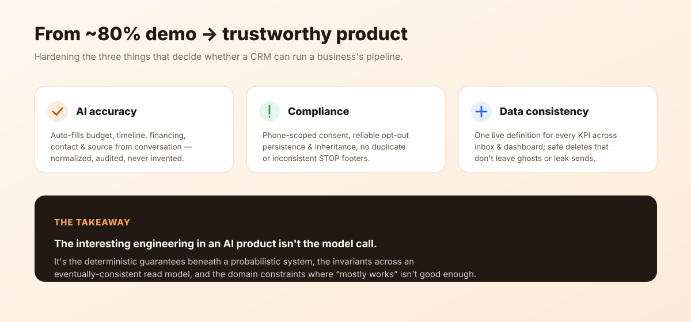

- Took an ~80%-complete build toward launch-ready by hardening the three areas that
  decide whether a CRM is trustworthy: **AI accuracy, messaging compliance, and data
  consistency.**
- **AI CRM auto-fill** now captures budget, area, timeline, pre-approval, notes, and
  contact/source from natural conversation — with normalization, provenance, and
  guards that keep it from inventing data or overwriting human edits.
- **One consistent, live "needs reply" definition** across inbox and dashboard,
  replacing three contradictory numbers.
- **Compliance correctness** on the SMS path: phone-scoped consent, reliable opt-out
  persistence and inheritance, and no duplicate/inconsistent STOP footers.
- **Safer lifecycle operations:** conversation purge on delete without forgetting
  opt-outs, and a clear, reviewed design for cancelling in-flight sends on deletion.

---

## What I Took Away

The interesting engineering in an AI product isn't the model call — it's everything
around it: the **deterministic guarantees** you put beneath a probabilistic system,
the **invariants** you enforce across an eventually-consistent read model, and the
**domain constraints** (compliance, billing, deletion) where "mostly works" isn't
good enough. Building on a fully serverless edge stack sharpened all of that —
you can't paper over inconsistency with a long-running process; every write path has
to be correct on its own.

---

## Tech Stack

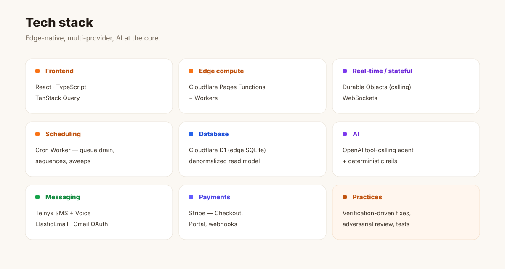

| Layer | Technology |
|---|---|
| Frontend | React, TypeScript, TanStack Query |
| API / edge compute | Cloudflare Pages Functions, Workers |
| Real-time / stateful | Cloudflare Durable Objects (calling/WebRTC), WebSockets |
| Scheduling | Cloudflare Cron Worker (queue drain, sequences, sweeps) |
| Database | Cloudflare D1 (edge SQLite), denormalized read model |
| AI | OpenAI tool-calling agent + deterministic fallback + governed field engine |
| Messaging | Telnyx (10DLC SMS + programmable voice), ElasticEmail, Gmail OAuth |
| Payments | Stripe (Checkout, Portal, webhooks) |
| Practices | Verification-driven fixes, adversarial review, unit tests, phased scope |

---

<!--
Before publishing: this is a client project. Consider whether to name the product
publicly, and keep it free of anything sensitive (it already omits secrets, IDs, and
client PII). A quick OK from the client on using the product name is worthwhile.
All diagrams are hand-authored SVGs in ./images — edit colors/text freely, or export
to PNG for platforms that don't render SVG.
-->
